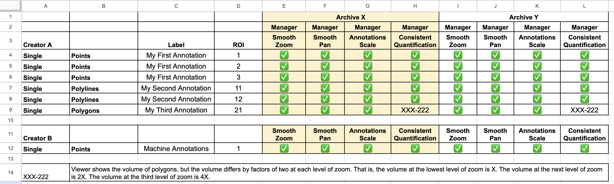

# Viewer Record Rendering

|                   |                                                         |
|-------------------|---------------------------------------------------------|
| Test Participants | Annotation Creator, Archive, Viewer                     |
| Test Driver       | Viewer                                                  |
| Multiplicity      | Once for each combination of Annotation object, Archive |

## Purpose
The Annotation Viewer creates a screen recording with a narrative to show how the
Viewer software renders the Annotation objects created by the Archive Creator
as stored on an Archive.

From the view point of the Viewer system, the Annotation Creators have created M total Annotation objects and have stored these to N total Archive systems.
For completeness, the Viewer will complete M x N instances of this test, one for each
of the Annotation / Archive combinations.

As you read the instructions, you will see that we will allow combined screen recordings
to reduce the burden of managing multiple sessions and digital recording files.

NB: The recordings are intended to be viewed by the Test Manager and Subject Matter Experts. The recordings will not be distributedd to other participants or publicly after testing.

## Evidence Required
1. Digital recordings that are viewable on Mac or Microsoft Windows systems that shows a user navigating through the Annotation objects submitted by Annotation Creators.

## Procedure
The Annotation Viewer is responsible for obtaining configuration from the Archive systems.
The Test Manager will provide the list of WSI data and Annotation objects to be rendered.
The Test Manager will also provide metadata spreadsheets and rendering documentation supplied by the Annotation Creator systems.

This procedure is written as if the Annotation Viewer was running a single test with one slide image and one Annotation object that have been stored on one Archive. This would yield one digital recording of the rendering process described below.
For the sake of efficiency, we image that the Annotation Viewer might make one recording session that covers one Archive system and multiple Annotation objects.
Use common sense for this tedious task and provide enough information for the Test Manager to interpret the digital recording.

1. Review the metadata and other material provided by the Annotation Creator. In addition to identifying the slide / annotation metadata, you will be required to render each of the areas of interest designated by the Annotation Creator.
2. Create a slide (Power Point, etc.) with a large font that identifies the WSI data, Annotation Object and Archive that is to be tested. Include this information on the slide:
   - Annotation Viewer
   - Annotation Creator
   - Archive System
   - Slide Identity
   - Annotation Identity
   - Number of Regions of Interest Identified by the Annotation Creator
   - Number of Pyramid Levels in the WSI data

3. Create a video recording of your screen while you follow these steps:
   - Show the slide referenced above
   - Read the slide information as part of the recording
   - Display the screen capture provided by the Annotation Creator that shows the geometric objects at a low level of zoom. The goal is that we can see all of the areas of interest that have been labeled by the Annotation Creator. In this recording, we do not expect to see great detail.
   - Render the slide at the lowest zoom level. The goal is that the user should be able to see the entire slide on the display. There should be some likeness to the rendering provided by the Annotation Creator.
   - Navigate to the first area of interest at this lowest level of zoom. State the index number provided by the Annotation Creator so we understand your intention. Zoom slowly through the image while trying to stay in the area of interest. Pan left, right, up, down such that the contents of the screen have to be replaced. Return to the original area of interest. *This may be difficult if there are not obvious landmarks in the image.* The goal is to zoom through every pyramid file and see that the Annotation geometric objects are faithfully rendered in a way that is *subjectively* useful to a human observer. Provide any comments that you think are relevant to help the Test Manager understand the navigation and rendering process.
   - Zoom back out to the lowest level of zoom, navigate to the next area of interest, state the index number provided by the Annotation Creator, and repeat the zoom process described above.

## Evaluation
You will evaluate the viewer's rendering of each region of interest (ROI) in each Annotation object that has been identified by the Annotation Creator.
This test is written in the contex of one Annotation Viewer, one Archive system and one Annotation object created by one Annotation Creator. That Annotation object will have one or more regions of interest to be reviewed. For this test, you will review all ROI's and score each one in the context of one Archive system.
 See *Scoring Example* in the appendix for an explanation of the guide and suggestions for maintaining an efficient scoring process.

NB: There are no guidelines given to Annotation Creator systems. A Creator might produce one Annotation object and identify a single ROI for review. A Creator might produce multiple Annotation objects with multiple ROI's in each object.

1. Review the image and annotation metadata provided the Annotation Creator to be able to identify the data on the Archive system.
2. Review the screen captures of the ROI's provided by the Annotation Creator to establish a baseline for rendering.
3. Watch the rendering video provided by the Annotation Creator and score each Region of Interest in the context of one Archive system using these criteria:
   - Does the Annotation Viewer smoothly zoom from the lowest magnification to the highest magnification for this ROI? Does the Annotation Viewer retrieve and render each level in the pyramid while zooming. *This might be difficult to determime.*
   - At each zoom level chosen by the Annotation Viewer, does the recording show that the application pans enough in at least one direction to require that a new screen of data must be rendered? Does the Annotation Viewer return to the nominal "center" of the ROI? *This is not a hard requirement. We merely want the Annotation Viewer to zoom in at roughly the x,y location for a given ROI.
   - As the Annotation Viewer is zooming in, do the geometric objects scale appropriately with the pixel zooming?
      - Do the geometic objects scale at the same time as the pixels are zoomed, or are the geometric objects held contstant or possibly disabled in some way until the user stops zooming.
      - As the user goes through the zooming process, do the geometric objects "jump/shift/etc"?
      - As the user pauses at different zoom levels, do you see any differences in how/where the geometric objects are rendered in relation to any landmarks you can identify in the image?
   - If the Annotation Viewer renders any quantification information based on the geometric objects (length, area, volume, ...), are the values consistent as the application applies different zoom factors?

## Appendix Material

### Scoring Example

The scoring worksheet for the Viewer Record Rendering test is related to other Project Manager worksheets.
The first difference is that this worksheet contains one row for each region of interest that has been identified by the Annotation Creator. This will allow you to score each ROI independently.

You will be marking each cells as Pass/Fail.
In the event of some issue, you will place a reference number in the cell and explain the issue further down in the spreadsheet.
For the purposes of the initial evaluation, the reference number need only be consistent within the spreadsheet. The Test Manager will catalog the issues and number them consistently across all spreadsheets.