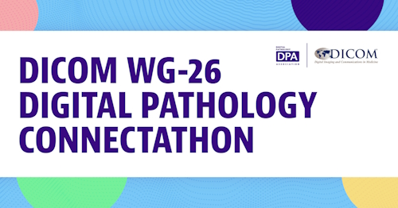
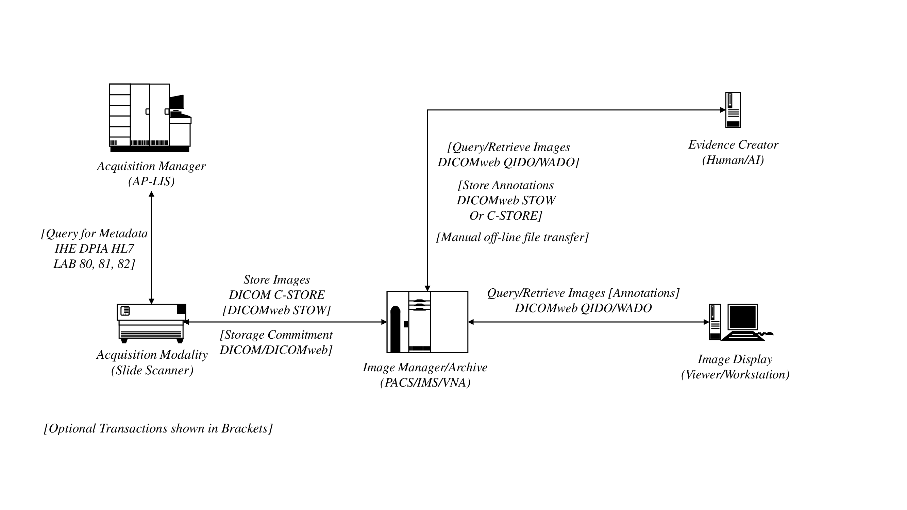

## Spring 2025 - Connectathon

#### *[Important Links](./links.md)*

The 2025 DICOM WG-26 Connectathon will take place between January 29th - June 3rd, 2025. 

Registration is open from Dec 18th, 2024 - January 28th, 2025.

Participants in the Spring 2025 Connecathon may have opportunity to participate in an Interoperability Showcase at the 2025 [European Congress on Digital Pathology](https://www.ecdp2025.org/) and at the 2025 [Pathology Visions Conference](https://digitalpathologyassociation.org/pathology-visions-conference).

**The Spring 2025 Connectathon is distinctive in that for the first time:**

- AP-LIS implementers are expected to participate and provide slide metadata via IHE PaLM DPIA HL7 V2 messages that can be used by the slide scanners
- Full image acquisition workflow (IS->scanner->archive->viewer) is combined with annotation creation (“Evidence Creator” actors) rather than using only pre-staged offline image files to test annotation creation and archiving
- Various workflow-specific services will be optionally tested (like storage commitment)
- Color management by viewer through use of ICC profiles created by scanners is expected

Additionally the Connectathon will be conducted "virtually" with all participants connecting via public networks.

### Who Can Participate?

Any organization that develops, supports or operates a technology system related to the goals of the current Connectathon may register to participate.  This includes software or hardware vendors who supply a solution that qualifies for one of the primary actors in the digital pathology interoperability ecosystem.  It also includes healthcare organizations that operate a technology system.  Participants may utilize systems that fulfill one or more of the actor roles defined.  

To participate in the WG-26 Connectathon a participant needs to:

- Register their intent to participate within the open registration period
- Provide a system that meets one or more of the specified actor roles
- Provide a single point of contact for communication during the Connectathon event
- Actively participate in interoperability testing and validation during the event.

### Registration
Registration is open from December 18th, 2024 - January 28th, 2025.  Participation in this Connectathon will be closed after the deadline so please register before.  
### [Connectathon Registration Link ](https://docs.google.com/forms/d/e/1FAIpQLSewuhNqynEY_J15e4lBDPpyb5UhUY-DruqcX-HyKuKivCX_TA/viewform)

### Goals

- Engage all primary actors in digital pathology interoperability: 
  - Anatomic Pathology Laboratory Information System (AP-LIS) (“Acquisition Manager”)
  - Slide Scanner (“Acquisition Modality”)
  - Archive (“Image Archive//Manager”)
  - Viewer (“Image Display”)
  - Annotation Creator (“Evidence Creator”)
  - Consumer (“Image Display” that supports annotations)

<object data="../assets/images/2025SpringConnectathonTechnicalOverview_ActorsAndTransactions.svg" type="image/svg+xml"></object>

- Virtual demonstration of image acquisition workflow from scanning to annotation creation and viewing (end to end)
- Demonstrate the ability of viewers to consume and display Bulk Microscopy Annotations from any creator
- Educate digital pathology users on the value of DICOM interoperability such they will ask for it from their vendors.

### Connectathon Technical Requirements
The requirements document provides an overview of the event and describes the technical and logistical requirements a participant needs to satisfy.

The document was approved by the DICOM Working Group 26 on December 17th, 2025.  Some of the requirements may be adjusted prior to start of the Connectathon on January 29th, 2025

[DICOM Digital Pathology Connectathon Technical Requirements - Spring 2025](https://docs.google.com/document/d/1Ivs091391wGEjpZQZKfWG8I7Kk0S5twK/edit?usp=sharing&ouid=111083561697945911253&rtpof=true&sd=true)

### Previous WG 26 Connectathons

[Links to information about previous events](https://dicom-wg26-connectathons.github.io/)

