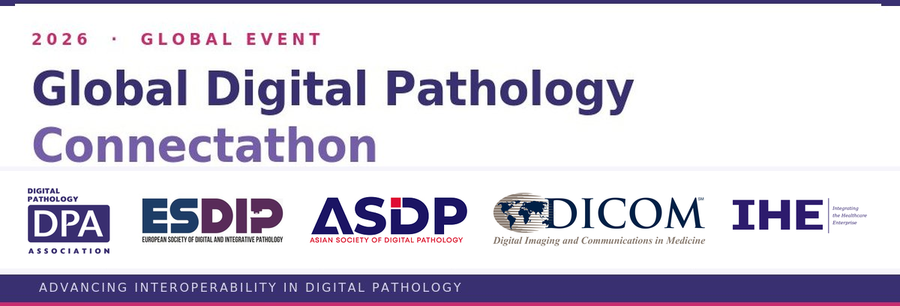

# 2026 - Connectathon

The 2026 Global Digital Pathology Connectathon will take place between May 6th - August 28th, 2026. 

Registration is open from **April 21st - May 6th, 2026**.

Participants in the 2026 Connecathon may have opportunity to participate in an Interoperability Showcase at the 2026 [Pathology Visions Conference](https://digitalpathologyassociation.org/pathology-visions-conference).

Similar to the last couple years, the Connectathon will be conducted "virtually" with all participants connecting via public networks.

### Who Can Participate?

Any organization that develops, supports or operates a technology system related to the goals of the current Connectathon may register to participate.  This includes software or hardware vendors who supply a solution that qualifies for one of the primary actors in the digital pathology interoperability ecosystem.  It also includes healthcare organizations that operate a technology system.  Participants may utilize systems that fulfill one or more of the actor roles defined.  

To participate in the WG-26 Connectathon a participant needs to:

- Register their intent to participate within the open registration period
- Provide a system that meets one or more of the specified actor roles
- Provide a single point of contact for communication during the Connectathon event
- Actively participate in interoperability testing and validation during the event.

### Registration
Registration is open from April 21st - May 13th, 2026.  Participation in this Connectathon will be closed after the deadline so please register before.  
### [Connectathon Registration Link ](https://docs.google.com/forms/d/e/1FAIpQLSeD4vhpMWNwvRM8n23X1fXWNNrcUvHornbW6deaV7mqyZXlyw/viewform)

### Goals

- Engage all primary actors in digital pathology interoperability: 
  - Anatomic Pathology Laboratory Information System (AP-LIS) (“Acquisition Manager”)
  - Slide Scanner (“Acquisition Modality”)
  - Archive (“Image Archive//Manager”)
  - Viewer (“Image Display” that supports images +/- annotations)
  - Annotation Creator (“Evidence Creator”)

### Connectathon Logistical Requirements
The requirements document provides an overview of the event and describes the technical and logistical requirements a participant needs to satisfy.

The document was approved by the DICOM Working Group 26 on April 21st, 2026.  Some of the requirements may be adjusted prior to start of the Connectathon on May 8th, 2026.

[DICOM Digital Pathology Connectathon Logistical Requirements - 2026](https://digitalpathologyassociation.org/_data/media/100766/connectathon-logistics-doc.pdf)

### Connectathon Technical Requirements
The requirements document provides an overview of the event and describes the technical and logistical requirements a participant needs to satisfy.

The document was approved by the DICOM Working Group 26 on April 21st, 2026.  Some of the requirements may be adjusted prior to start of the Connectathon on May 8th, 2026.

[DICOM Digital Pathology Connectathon Technical Requirements - 2026](https://docs.google.com/document/d/1VH7olijdBBCXR1WPdrn7AhrdFzg8leKa)

### Previous WG 26 Connectathons

[Links to information about previous events](https://dicom-wg26-connectathons.github.io/)

